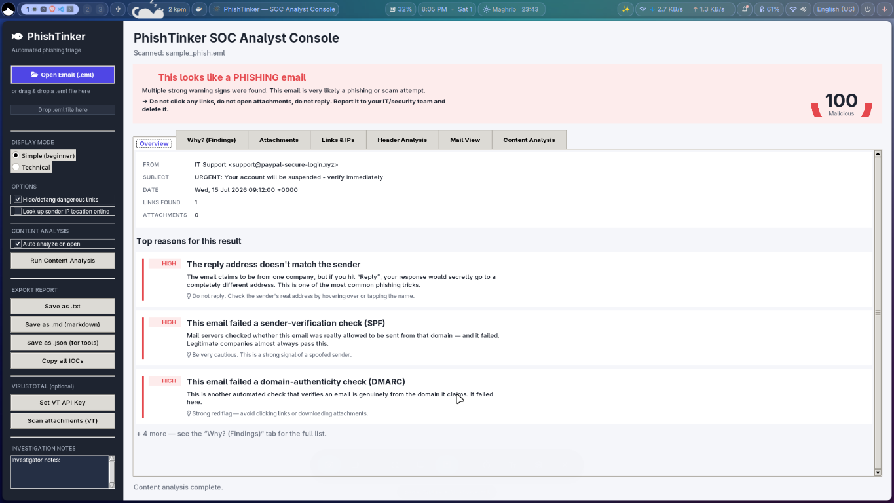

# SOC Tools

Welcome to the SOC Tools repository — a growing collection of analyst-focused security tools, organized by SOC domain and built to help defenders investigate, triage, and respond faster.



## Overview

This repo is designed as a central home for SOC tooling and automation. The first released project is **PhishTinker**, a phishing analysis and email triage tool that runs locally with both a polished GUI and a headless CLI mode.

The repository is planned to include tools across the following SOC categories:

- `01_Phishing_Analysis.zip`
- `02_Network_Security.zip`
- `03_Endpoint_Security.zip`
- `04_SIEM.zip`
- `05_Threat_Intelligence.zip`
- `06_Digital_Forensics.zip`
- `07_Incident_Response.zip`

Each part will eventually contain purpose-built tools, scripts, and workflows for that SOC domain.

## Current Tool: PhishTinker

PhishTinker is the first publicly available tool in this repo. It helps SOC analysts rapidly inspect suspicious `.eml` email samples and clearly identify phishing indicators without relying on cloud services by default.

### PhishTinker features

- SOC-friendly, polished interface with a tabbed investigation workflow
- Email overview, sender and recipient analysis, header inspection, and content review
- Full findings panel showing why an email appears malicious
- Attachments extraction and analysis support
- Links and IPs tab for extracting indicators of compromise
- DMARC/SPF/validation and sender-verification checks
- Export reports as text, Markdown, or JSON
- Optional VirusTotal attachment lookup via API key
- One-click copy of all IOCs for threat hunting or reporting
- Headless CLI mode for batch processing and automation

## Getting Started with PhishTinker

1. Open the `Phishing Tinker Tool` directory.
2. Install dependencies and package locally if required.
3. Run the GUI or CLI as documented in `Phishing Tinker Tool/README.md`.

### Example

```bash
cd "Phishing Tinker Tool"
python3 -m phishtinker
```

or for CLI usage:

```bash
python3 -m phishtinker samples/sample_phish.eml --format markdown -o report.md
```

## Repository Structure

- `Phishing Tinker Tool/` — current phishing analysis tool and supporting files
- `assets/` — repository images and documentation assets
- future SOC domains will appear as additional directories or zipped modules

## Why this repo?

This repo is for building practical SOC utilities that help analysts handle phishing, network threats, endpoints, SIEM ingestion, threat intelligence, forensics, and incident response. The goal is to keep tools lightweight, effective, and easy to use in real analyst workflows.

## Contributing

Contributions, ideas, and new tool suggestions are welcome. If you want to add a new SOC utility or expand an existing category, please open an issue or submit a pull request.

---

*Note: The exact number of tools is flexible and may grow over time. This repository is structured to evolve with new SOC tool categories as they are created.*
